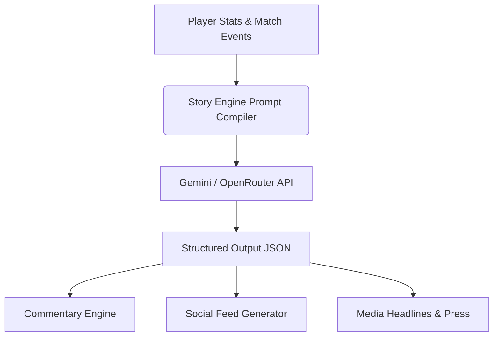

# 🏏 ATHLETE//ZERO

> **Live the rise of a cricket superstar.**

**ATHLETE//ZERO** is an AI-powered cricket career simulator that combines cinematic storytelling, social media drama, intense rivalries, match simulations, and a deep progression system into an immersive sports gaming experience. 

Designed for hackathons with a focus on high-fidelity visual polish, AI-generated interactions, and a dramatic, broadcast-style atmosphere, it places you directly inside the shoes of a rising cricket prodigy.

---

## 🎮 Concept

Experience the journey of a rookie cricketer rising through the ranks of professional cricket. The player creates their cricket identity, develops specialized skills, manages rivalries, grows a fanbase, receives lucrative sponsor offers, and plays high-pressure matches to build a lasting legacy.

The game world dynamically reacts to every action and match outcome via:
* **🤖 AI-Generated Commentary:** Live, context-aware commentary matching the game's energy.
* **💬 Social Media Buzz:** Realistic fan posts, critic tweets, and trending hashtags reacting to player performance.
* **📰 Media Headlines:** Dynamic sports news articles covering the player's career milestones.
* **🔥 Rival Interactions:** Post-match press conferences and trash talk that adapt based on match history.

---

## ✨ Core Features

### 🧑 Player Creation
Create and customize your unique cricket identity:
* **Custom Profile:** Name, batting/bowling roles, batting style, and bowling type.
* **Personality & Specialty:** Define traits that affect media reactions and on-field temperament.
* **Dynamic Player Card:** Instantly generated FIFA-style cards visualizing player stats and attributes.

### 📊 Career Hub Dashboard
A cinematic, broadcast-inspired central command center featuring:
* Current career stats, overall ratings, and form tracker.
* Interactive matches schedule and league standings.
* Performance graphs visualising skill progression over time.
* Real-time notifications for incoming sponsorships and media inquiries.

### 📱 Social Media Simulation
A live social feed inspired by sports platforms (Twitter/X):
* Dynamic, AI-generated tweets from fans, analysts, and rivals.
* Viral trends, hashtags, and memes adapting in real time to match performances.
* Interactive choices to respond to certain posts, affecting public reputation.

### 😈 Rivalry System
A structured system pitting the player against hand-crafted, AI-driven rivals:
* Pre-match trash talk and psychological press conferences.
* Rivalry progression tracking head-to-head stats (wickets, runs, match-wins).
* Dynamic dialouge that adapts based on wins, losses, or nail-biting finishes.

### 🏟 Match Simulation Engine
The centerpiece of the game, designed for high emotional impact:
* **IPL-style Scoreboard:** High-fidelity, broadcast-style match tracking.
* **Interactive Commentary:** A text feed that feels like a live TV overlay.
* **Momentum Graph:** Displays which team is dominating in real time.
* **Crowd Intensity:** Visual and audio cues matching the pressure of the match.

### 🚀 Career Progression
Level up your athlete and define your path to glory:
* Gain XP from training, match play, and media engagements.
* Unlock game-changing perks and personality traits.
* Grow a fan following that boosts confidence and unlocks higher-tier matches.

### 💰 Sponsor System
Manage the business side of a professional athlete's career:
* Receive endorsements from fictional brands based on popularity.
* Sign high-paying contracts to purchase gear, boost training, or customize your avatar.
* Maintain sponsor satisfaction through press responses and career performance.

### 📰 AI Story Engine
Under the hood, a dynamic prompt-based story generator powers the universe:
* Generates contextual commentary based on player choices and scoreboard updates.
* Crafts newspaper headlines and sportscast dialogues.
* Automates custom DM messages from rivals, sponsors, and team coaches.

---

## 🧠 AI Architecture

To fit hackathon constraints, prioritize speed, and reduce complexity, ATHLETE//ZERO implements a **simulated agent network** rather than fully autonomous, real-time agents:



* **Structured Prompting:** Outputs are requested in JSON format to guarantee clean UI rendering.
* **Simulated Multi-Agent Behavior:** Rival, Sponsor, and Journalist behaviors are handled as distinct prompt templates with isolated contexts.

---

## 🛠 Tech Stack

### Frontend
* **Framework:** [Next.js](https://nextjs.org/) (App Router)
* **Styling:** [Tailwind CSS](https://tailwindcss.com/)
* **Animations:** [Framer Motion](https://www.framer.com/motion/)
* **Component Library:** [shadcn/ui](https://ui.shadcn.com/)

### Backend
* **Runtime:** Node.js
* **Endpoints:** Next.js API Routes / Express.js

### AI & LLMs
* **APIs:** [OpenRouter](https://openrouter.ai/), Gemini API, or OpenAI API
* **SDKs:** Google Gen AI SDK / Vercel AI SDK

---

## 🎨 Design Philosophy

ATHLETE//ZERO feels like a premium sports broadcast overlay met a high-fidelity sports documentary:
* **Inspirations:** IPL Broadcast graphics, ESPN Cricinfo coverage, EA Sports FC Career Mode, Netflix sports docuseries.
* **Visual Identity:** Rich dark mode UI with high-contrast neon accents, clean typography (e.g., *Inter*, *Outfit*), card glassmorphism, and smooth page transitions.
* **Focus:** Immersive, high-energy, and modern. *Not* a hacker/cyberpunk overlay or a purely text-based simulator.

---

## 📂 Project Structure

```bash
/app                  # Next.js App Router (pages, layout, routing)
/components           # Reusable UI elements
  ├── /dashboard      # Career Hub panels, stats charts, calendar
  ├── /match          # Scoreboard, momentum graph, commentary feed
  ├── /social         # Live social feed, rival tweets, DMs
  ├── /player         # Player card generator, attribute editor
  ├── /rival          # Press conference UI, head-to-head panels
  └── /ui             # Core primitives (buttons, dialogs, cards)
/hooks                # Custom React hooks (game state, API polling)
/store                # Client-side state management (Zustand/Redux)
/lib                  # Utilities (AI prompt compilers, API clients)
/styles               # Tailwind stylesheets & CSS variables
/assets               # Static assets (images, icons, sound effects)
```

---

## 🔌 API Structure

### Player APIs
* `POST /api/create-player` — Initializes a new athlete profile.
* `GET /api/player` — Retrieves the current player details and stats.
* `PATCH /api/player-stats` — Updates attributes (e.g., batting skill, confidence).

### Match APIs
* `POST /api/start-match` — Configures and initializes a new match simulation.
* `GET /api/match-events` — Stream of ball-by-ball simulated events.
* `GET /api/commentary` — Retrieves context-specific AI commentary.

### Social APIs
* `GET /api/social-feed` — Fetches current tweets and media posts based on career state.
* `GET /api/fan-reactions` — Generates crowd reactions post-event.

### Rival APIs
* `GET /api/rival` — Retrieves active rival details and history.
* `POST /api/rival-response` — Sends player press conference answers to adjust rival tension.

### AI APIs
* `POST /api/generate-story` — Triggers narrative events.
* `POST /api/generate-commentary` — Generates ball-by-ball flavor commentary.
* `POST /api/generate-headlines` — Populates the career news hub.

---

## 🎯 MVP Scope

To maximize impact in a hackathon setting, the project focuses on:
* **Landing Page:** Immersive opening screen introducing the concept.
* **Player Creator:** Fully interactive character generation and player card display.
* **Career Dashboard:** Hub displaying current standings, stats, social feeds, and inbox.
* **Match Simulation:** Fully animated 5-over match with dynamic commentary, scoreboards, and crowd noises.
* **Post-Match Progression:** Stat boosts, fan milestones, and social reactions sequence.

### 🚫 Non-Goals
* Real-time multiplayer.
* User authentication and persistent databases (managed via `localStorage` for the demo).
* Full 3D or 2D physics-based gameplay.

---

## 🏆 Demo Flow

The presentation flow tracks: **Rookie** ➡️ **Rivalry** ➡️ **Big Match** ➡️ **Viral Stardom**

1. **Create Player:** Customize profile and watch the player card generate.
2. **Enter Hub:** Check your starting stats and read the initial news welcoming you.
3. **Rivalry Callout:** Receive a direct message or tweet from your rival challenging you.
4. **The Match:** Enter the Match Simulator, witness crucial nail-biting deliveries, and experience the broadcast-style visuals.
5. **Aftermath:** Review viral posts reacting to your game-winning performance and level up your player card.
6. **Sponsorship:** Receive your first major endorsement offer!

---

## 🌟 Vision

ATHLETE//ZERO aims to explore the intersection of AI-driven sports storytelling, immersive gamified career loops, and premium broadcast aesthetics, giving players **the feeling of living inside a cricket documentary.**
